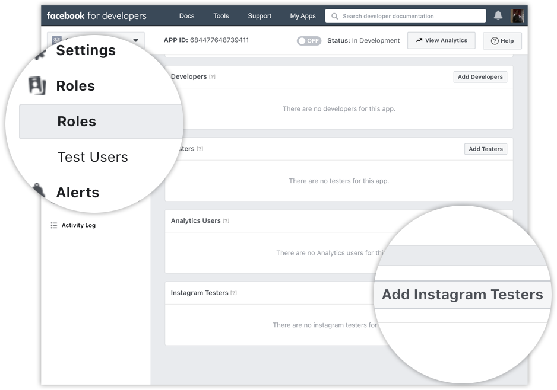

## Benodigdheden

* Een Facebook developer account
* Een instagram account

## Stappen

1. Ga naar https://developers.facebook.com/, klik op **My Apps**, en maak een app aan.
2. Ga dan vanuit de **App Dashboard** naar **Settings** > **Basic**, scroll naar beneden en klik op **Add Platform**.
   
3. Kies voor **Website** en vul de URL van je website in.
   
4. Klik op **Products**, vind het **Instagram** product, en klik op **Set Up**.
   
5. Klik op **Basic Display**, scroll naar beneden, en klik dan op **Create New App**.
   
6. Je krijgt een formulier te zien, wat je hier invult is niet heel belangrijk. Vul gewoon in wat nodig is om door te kunnen. Als je daarvoor een redirect URL moet verzinnen dan kun je er gewoon één verzinnen die niet echt bestaat.
7. Navigeer naar **Roles** > **Roles** en scroll naar beneden naar het gedeelte **Instagram Testers**. Klik op **Add Instagram Testers** en voer de gebruikersnaam van uw Instagram-account in en verstuur de uitnodiging.
   
8. Open een nieuwe tabblad in je browser en ga naar www.instagram.com en meld je aan op je Instagram-account dat je net hebt uitgenodigd. Navigeer naar **(Profiel Icoon)** > **Profiel bewerken** > **Apps en Websites** > **Tester Uitnodigingen** (oid) en accepteer de uitnodiging.
   
9. Ga terug naar het tabblad van de Facebook Developer Console en vind de **User Token Generator** in **App Dashboard** > **Products** > **Instagram** > **Basic Display** en genereer een token voor je instagram gebruikersaccount.
10. Geef dat token aan Aleks en dan zorgt hij voor de rest.